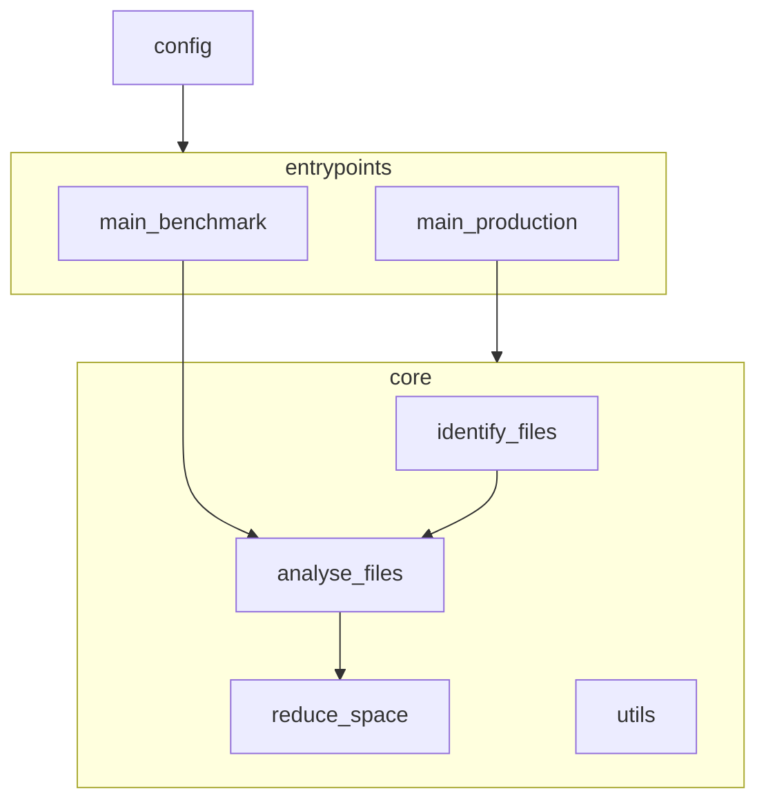

# security_camera_analysis

Detect objects in security camera footage.  
Clean up old footage based on detected objects to keep disk space usage low.

## Modules

### Entrypoints

- main_yolo_benchmark.py: benchmark different yolo models and settings
- main_production.py: production script to be run on a schedule (e.g. via cronjob)
- config.py: configuration file for setting parameters

### Libraries

- identify_camera_files_to_process.py: selection logic tailored to how reolink organizes their FTP uploads
- analyse_images.py: analyzes the provided image files and generated a report per folder of detected objects
- reduce_disk_space.py: deletes old images based on retention policy and detected objects
- utils.py: utility functions

### Architecture drawing




## Example of JSON output from object detection

```json
{
  "day_cars_passing_by.mp4": [
    "truck",
    "car"
  ],
  "day_humans_walking.mp4": [
    "truck",
    "person",
    "skateboard",
    "car"
  ],
  "day_human_arriving_by_car.mp4": [
    "truck",
    "car",
    "train",
    "person"
  ]
}
```

## Performance Evaluation

To benchmark this a series of test videos was selected. Each portrays a different scenario:

 Image                         | Day / Night | Contains Human 
-------------------------------|-------------|----------------
 day_cars_passing_by.mp4       | Day         | ❌              
 day_driving_cars.mp4          | Day         | ❌              
 day_human_arriving_by_car.mp4 | Day         | ✅              
 day_human_cyclist.mp4         | Day         | ✅              
 day_humans_walking.mp4        | Day         | ✅              
 day_nothing_at_all.mp4        | Day         | ❌              
 day_parked_car_humans_cat.mp4 | Day         | ✅              
 night_cat_human_on_bike.mp4   | Night       | ✅              
 night_humans.mp4              | Night       | ✅              
 night_nothing_but_wind.mp4    | Night       | ❌              
 night_parked_car.mp4          | Night       | ❌              

During benchmarking the following metrics were evaluated:

- Accuracy: the proportion of all classifications that were correct.
- Precision: the proportion of all the model's positive classifications that are actually positive.
- False positive rate (FPR): the proportion of all actual negatives that were classified incorrectly as positives.

 System   | Frame_skip | Yolo Model | VSize | Elapsed time (s) | Accuracy | Precision | FPR  
----------|------------|------------|-------|------------------|----------|-----------|------
 R7 5800U | 1          | small      | 1080  | 831              | 0.82     | 0.75      | 0.40 
 R7 5800U | 1          | small      | 720   | 740              | 0.82     | 0.75      | 0.40 
 R7 5800U | 1          | small      | 480   | 740              | 0.90     | 0.86      | 0.20 
 R7 5800U | 1          | nano       | 1080  | 488              | 0.90     | 0.86      | 0.20 
 R7 5800U | 1          | nano       | 720   | 440              | 1.00     | 1.00      | 0.00 
 R7 5800U | 1          | nano       | 480   | 422              | 0.90     | 0.86      | 0.20 
 R7 5800U | 3          | small      | 720   | 316              | 0.90     | 0.86      | 0.20 
 R7 5800U | 10         | small      | 720   | 181              | 1.00     | 1.00      | 0.00 
 R7 5800U | 30         | small      | 720   | 138              | 0.90     | 1.00      | 0.00 
 R7 5800U | 3          | nano       | 720   | 222              | 1.00     | 1.00      | 0.00 
 R7 5800U | 10         | nano       | 720   | 140              | 1.00     | 1.00      | 0.00 
 R7 5800U | 30         | nano       | 720   | 118              | 0.90     | 1.00      | 0.00 
 R7 5800U | 3          | nano       | 480   | 200              | 1.00     | 1.00      | 0.00 
 R7 5800U | 10         | nano       | 480   | 116              | 1.00     | 1.00      | 0.00 
 R7 5800U | 30         | nano       | 480   | 94               | 1.00     | 1.00      | 0.00 
 R7 5700X | 10         | nano       | 480   | 75               | 1.00     | 1.00      | 0.00 
 

Conclusion:
- nano is significantly faster than small
- lower resolutions still yield good results
- frame skipping can go up to 10-30 without losing accuracy
- with all optimizations in place, ffmpeg conversion begins to take a more dominant role in total processing time
- 5700X is 35% faster than 5800U for same settings.

## Production output
Running the production entrypoint will provide output to stdout as well as write the detect_objects.json files and the boxed jpg images.  
Example output:
```
[2025-09-04T22:27:00] Listing all video files in folder: T:\ftp_reolink\reolink\2025
[2025-09-04T22:27:01] Found 46478 video files in total
[2025-09-04T22:27:01] After filtering, 43603 files remain to be processed
[2025-09-04T22:27:01] Creating YOLO model: yolov8n.pt
[2025-09-04T22:27:01] Processing file: Camera-1_00_20250118123855.mp4
[2025-09-04T22:27:01] Converting video file to lower resolution: T:\ftp_reolink\reolink\2025\01\18\Camera-1_00_20250118123855.mp4 → ../data/temp\Camera-1_00_20250118123855.mp4
[2025-09-04T22:27:05] Starting object detection for file Camera-1_00_20250118123855.mp4
[2025-09-04T22:27:07] Persisting detected objects to file: T:\ftp_reolink\reolink\2025\01\18\detected_objects.json
[2025-09-04T22:27:07] Objects detected: car
[2025-09-04T22:27:07] Removed temporary file: C:\devcopy\security_camera_analysis\data\temp\Camera-1_00_20250118123855.mp4
[2025-09-04T22:27:07] Evaluating whether to remove file: T:\ftp_reolink\reolink\2025\01\18\Camera-1_00_20250118123855.mp4
[2025-09-04T22:27:07] Removed file: T:\ftp_reolink\reolink\2025\01\18\Camera-1_00_20250118123855.mp4
[2025-09-04T22:27:07] Processing file: Camera-1_00_20250118123928.mp4
```


## Future work
- Remove the jpg uploaded by reolink if this seems advantageous.
- Experiment with higher threshold if space savings are not sufficient.


## Installation

```bash
git clone https://github.com/jorritvm/security_camera_analysis.git
cd security_camera_analysis/
uv sync
source .venv/bin/activate
```

## Author
Jorrit Vander Mynsbrugge 


