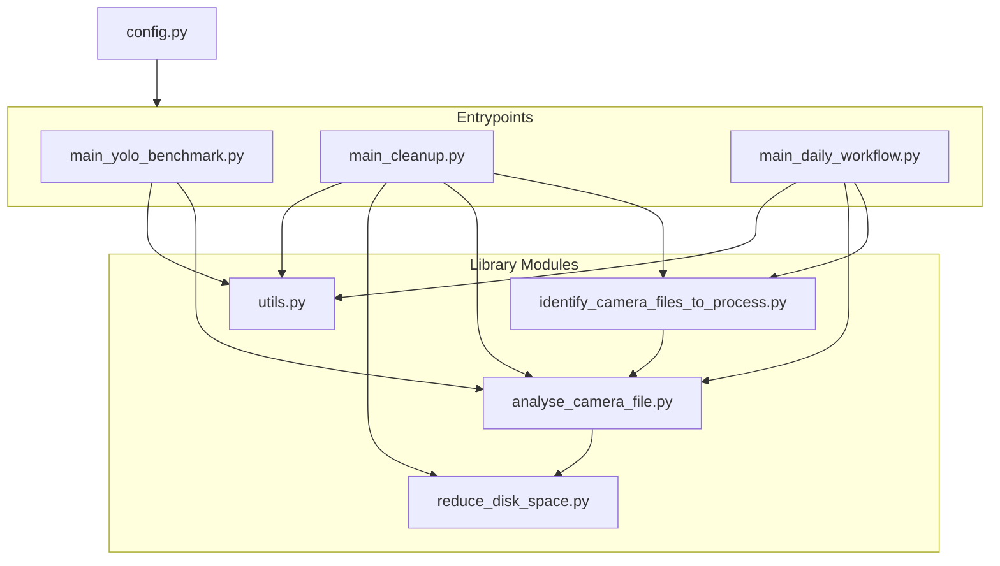

# Video Processing

The video processing module (`src_processing/`) provides automated analysis and management of security camera footage. 
It uses YOLOv8 to detect objects (people, cars, etc.) in video files, saves metadata and still images, 
and implements intelligent disk space management strategies.

<!-- TOC -->
* [Video Processing](#video-processing)
  * [Installation](#installation)
  * [Entrypoints, configuration and usage](#entrypoints-configuration-and-usage)
    * [1. **main_yolo_benchmark.py** - Performance Benchmarking](#1-main_yolo_benchmarkpy---performance-benchmarking)
    * [2. **main_cleanup.py** - Simple Processing Workflow](#2-main_cleanuppy---simple-processing-workflow)
    * [3. **main_daily_workflow.py** - Advanced Disk Space Management](#3-main_daily_workflowpy---advanced-disk-space-management)
  * [Module Structure](#module-structure)
    * [Library Modules](#library-modules)
    * [Architecture](#architecture)
  * [Example of JSON output from object detection](#example-of-json-output-from-object-detection)
  * [Benchmark details](#benchmark-details)
    * [Setup](#setup)
    * [Results](#results)
    * [Conclusion](#conclusion)
<!-- TOC -->

## Installation

```bash
git clone https://github.com/jorritvm/security_camera_analysis.git
cd security_camera_analysis/
uv sync
source .venv/bin/activate  # On Windows: .venv\Scripts\activate
```

## Entrypoints, configuration and usage

The module provides three main entrypoint scripts for different use cases:

### 1. **main_yolo_benchmark.py** - Performance Benchmarking

**Purpose**: Evaluate and compare different YOLO model configurations to find optimal settings for your hardware.

**Use Case**: Run this once when setting up your system or when changing hardware to determine the best balance between speed and accuracy.

**What it does**:
- Tests different combinations of:
  - YOLO model sizes (nano, small, medium, large, xlarge)
  - Video resolutions (480p, 720p, 1080p)
  - Frame skip values (1, 3, 10, 30)
- Measures processing time, accuracy, precision, and false positive rate
- Outputs results to `benchmark_results.json`

**Usage**:
```bash
cd src_processing/
python main_yolo_benchmark.py
```

**Configuration**: Edit the script to uncomment specific benchmark configurations you want to test.

---

### 2. **main_cleanup.py** - Simple Processing Workflow

**Purpose**: Process new files and immediately remove those without target objects (e.g., people).

**Use Case**: Basic workflow for systems with simple cleanup requirements. Processes files one-by-one and deletes non-matching videos immediately after analysis.

**What it does**:
1. Scans for all video files in `ROOT_CAMERA_FOLDER_PATH`
2. Filters to find unprocessed files (unless `FORCE_REEVALUATION` is True)
3. For each file:
   - Runs YOLO object detection
   - Creates JSON metadata (`detected_objects.json`)
   - Saves still image if person detected (optional)
   - **Immediately deletes** the video if it doesn't contain target objects

**Usage**:
```bash
cd src_processing/
python main_cleanup.py
```

**Configuration**: Set parameters in `config.py`:
- `ROOT_CAMERA_FOLDER_PATH`: Root folder containing video files
- `KEEP_VIDEOS_WITH_OBJECTS`: Set of objects to keep (e.g., `{"person"}`)
- `DELETE_DRY_RUN`: Set to `True` for testing without actual deletion

---

### 3. **main_daily_workflow.py** - Advanced Disk Space Management

**Purpose**: Sophisticated daily workflow that manages disk space using a folder-based tiered retention strategy.

**Use Case**: Production systems that need to balance recent footage preservation with long-term storage of important events. Designed to run daily as a scheduled task. Efficiently manages disk space by treating entire camera date folders (yyyy/mm/dd) as units, accounting for all files (videos, JPG stills, metadata).

**What it does**:

**Step 1 - Process New Files**:
- Runs YOLO detection on all unprocessed videos
- Creates JSON metadata (`detected_objects.json`)
- Saves still images for videos with detected persons (if enabled)

**Step 2-6 - Folder-Based Disk Space Management**:

The workflow operates on camera date folders (yyyy/mm/dd format) rather than individual files:

1. **Calculate Folder Sizes**: 
   - Scans all camera folders and calculates total size of ALL files (mp4, jpg, json, etc.)
   - Caches results in `this_folder_size.txt` for performance
   - Only recalculates when folders are modified

2. **Phase 1 - Recent Folders** (Default: 500GB):
   - Identifies most recent folders (sorted by date) up to `RECENT_FILES_MAX_SIZE_GB`
   - **Keeps ALL content** in these folders untouched (videos, stills, metadata)
   - Preserves complete recent history regardless of content

3. **Phase 2 - Historical Folders with Target Objects** (Default: 400GB):
   - Starts from the folder that exceeded Phase 1 threshold
   - Removes individual video files WITHOUT target objects (e.g., no "person" detected)
   - Keeps JPG stills, metadata, and videos WITH target objects
   - Continues until cumulative size reaches `HISTORICAL_FILES_MAX_SIZE_GB`

4. **Phase 3 - Old Folders Complete Removal**:
   - All folders beyond Phase 2 threshold are **completely deleted**
   - Removes entire folder and ALL contents (videos, stills, metadata, cache files)
   - Maximizes space recovery for oldest footage

**Result**: 
- ~500GB of recent footage (everything preserved)
- ~400GB of historical footage (only videos with target objects, plus their stills/metadata)
- ~30GB free space buffer for incoming streams
- Efficient caching minimizes folder scanning overhead

**Usage**:
```bash
cd src_processing/
python main_daily_workflow.py
```

**Configuration**: Edit `config.py` to set:
```python
# Disk space management
RECENT_FILES_MAX_SIZE_GB = 500      # Recent folders to keep (all content)
HISTORICAL_FILES_MAX_SIZE_GB = 400  # Historical folders with target objects
FREE_SPACE_BUFFER_GB = 30           # Expected free space remaining
FOLDER_SIZE_FILENAME = "this_folder_size.txt"  # Cache file for folder sizes

# Also configure:
ROOT_CAMERA_FOLDER_PATH = "path/to/videos"
KEEP_VIDEOS_WITH_OBJECTS = {"person"}  # Objects to preserve in Phase 2
DELETE_DRY_RUN = False  # Set to True for testing without deletion
```

**Scheduling**: Set up as a daily cron job or Windows Task Scheduler task.

**Performance Notes**:
- Folder size caching significantly improves performance on large archives
- Only modified folders have their sizes recalculated
- Date-based folder sorting relies on yyyy/mm/dd format for correct chronological order

---

## Module Structure

```
src_processing/
├── config.py                        # Configuration file
├── main_yolo_benchmark.py          # Entrypoint: Benchmark YOLO models
├── main_cleanup.py                 # Entrypoint: Simple cleanup workflow
├── main_daily_workflow.py          # Entrypoint: Advanced daily workflow
├── models/                         # YOLO model files
│   ├── yolov8n.pt
│   └── yolov8s.pt
└── lib/                            # Core library modules
    ├── analyse_camera_file.py      # YOLO object detection logic
    ├── identify_camera_files_to_process.py  # File selection logic
    ├── reduce_disk_space.py        # Cleanup utilities
    └── utils.py                    # Logging and timing utilities
```

### Library Modules

- **analyse_camera_file.py**: Core YOLO detection logic, video conversion, and metadata persistence
- **identify_camera_files_to_process.py**: File discovery and filtering based on processing status
- **reduce_disk_space.py**: File removal utilities based on detected objects
- **utils.py**: Logging setup, timing utilities

### Architecture




## Example of JSON output from object detection

```json
{
  "day_cars_passing_by.mp4": [
    "truck",
    "car"
  ],
  "day_humans_walking.mp4": [
    "truck",
    "person",
    "skateboard",
    "car"
  ],
  "day_human_arriving_by_car.mp4": [
    "truck",
    "car",
    "train",
    "person"
  ]
}
```

## Benchmark details
### Setup

To benchmark this a series of test videos was selected. Each portrays a different scenario:

 Image                         | Day / Night | Contains Human 
-------------------------------|-------------|----------------
 day_cars_passing_by.mp4       | Day         | ❌              
 day_driving_cars.mp4          | Day         | ❌              
 day_human_arriving_by_car.mp4 | Day         | ✅              
 day_human_cyclist.mp4         | Day         | ✅              
 day_humans_walking.mp4        | Day         | ✅              
 day_nothing_at_all.mp4        | Day         | ❌              
 day_parked_car_humans_cat.mp4 | Day         | ✅              
 night_cat_human_on_bike.mp4   | Night       | ✅              
 night_humans.mp4              | Night       | ✅              
 night_nothing_but_wind.mp4    | Night       | ❌              
 night_parked_car.mp4          | Night       | ❌              

During benchmarking the following metrics are evaluated:

- Accuracy: the proportion of all classifications that were correct.
- Precision: the proportion of all the model's positive classifications that are actually positive.
- False positive rate (FPR): the proportion of all actual negatives that were classified incorrectly as positives.

### Results

 System   | Frame_skip | Yolo Model | VSize | Elapsed time (s) | Accuracy | Precision | FPR  
----------|------------|------------|-------|------------------|----------|-----------|------
 R7 5800U | 1          | small      | 1080  | 831              | 0.82     | 0.75      | 0.40 
 R7 5800U | 1          | small      | 720   | 740              | 0.82     | 0.75      | 0.40 
 R7 5800U | 1          | small      | 480   | 740              | 0.90     | 0.86      | 0.20 
 R7 5800U | 1          | nano       | 1080  | 488              | 0.90     | 0.86      | 0.20 
 R7 5800U | 1          | nano       | 720   | 440              | 1.00     | 1.00      | 0.00 
 R7 5800U | 1          | nano       | 480   | 422              | 0.90     | 0.86      | 0.20 
 R7 5800U | 3          | small      | 720   | 316              | 0.90     | 0.86      | 0.20 
 R7 5800U | 10         | small      | 720   | 181              | 1.00     | 1.00      | 0.00 
 R7 5800U | 30         | small      | 720   | 138              | 0.90     | 1.00      | 0.00 
 R7 5800U | 3          | nano       | 720   | 222              | 1.00     | 1.00      | 0.00 
 R7 5800U | 10         | nano       | 720   | 140              | 1.00     | 1.00      | 0.00 
 R7 5800U | 30         | nano       | 720   | 118              | 0.90     | 1.00      | 0.00 
 R7 5800U | 3          | nano       | 480   | 200              | 1.00     | 1.00      | 0.00 
 R7 5800U | 10         | nano       | 480   | 116              | 1.00     | 1.00      | 0.00 
 R7 5800U | 30         | nano       | 480   | 94               | 1.00     | 1.00      | 0.00 
 R7 5700X | 10         | nano       | 480   | 75               | 1.00     | 1.00      | 0.00 
 

### Conclusion
- nano is significantly faster than small
- lower resolutions still yield good results
- frame skipping can go up to 10-30 without losing accuracy
- with all optimizations in place, ffmpeg conversion begins to take a more dominant role in total processing time
- 5700X is 35% faster than 5800U for same settings.
